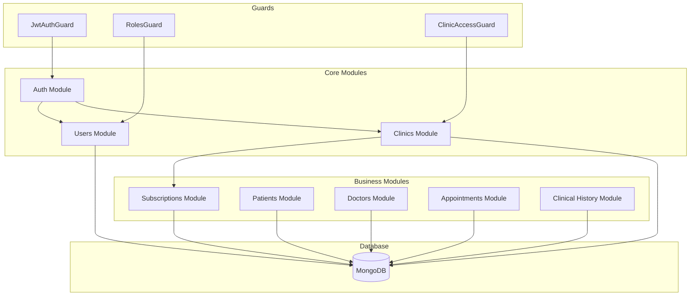
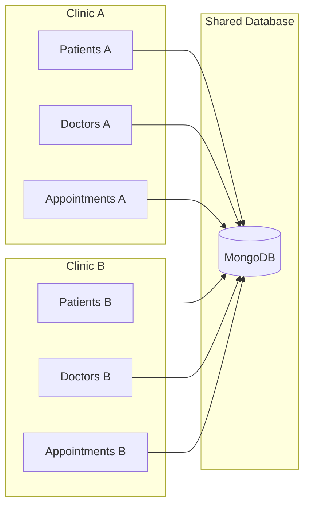
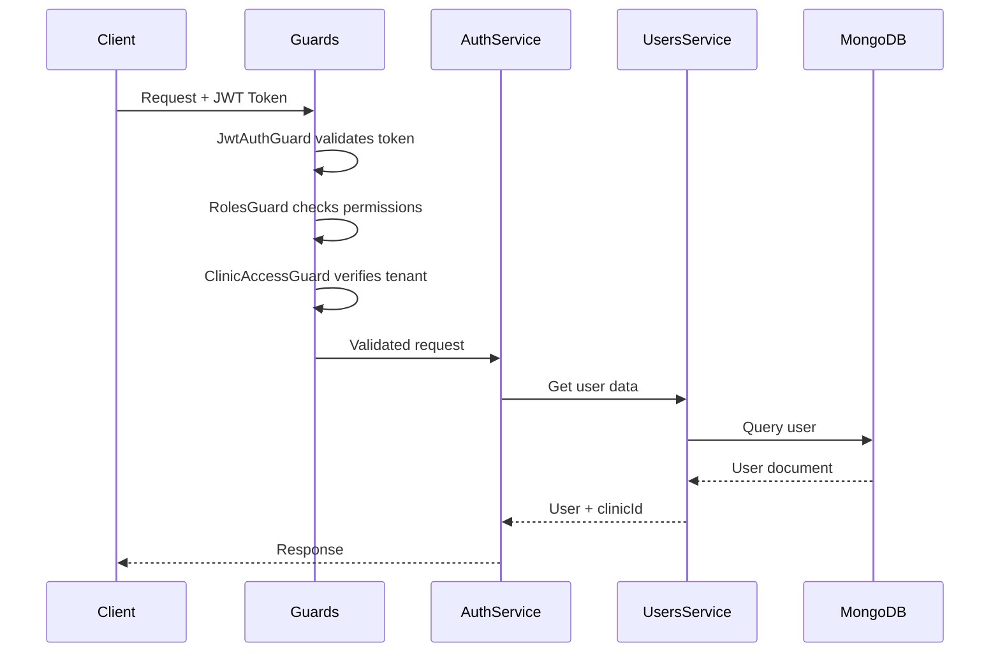

# Arquitectura del Sistema

## Visión General

Histora utiliza una arquitectura modular basada en NestJS con patrón de capas:

```
┌─────────────────────────────────────────────────────────────┐
│                        CLIENTS                               │
│              (Web App / Mobile App / API)                    │
└─────────────────────────┬───────────────────────────────────┘
                          │
┌─────────────────────────▼───────────────────────────────────┐
│                      API GATEWAY                             │
│                   (Guards + Pipes)                           │
│         ┌─────────────┬──────────────┬─────────────┐        │
│         │ JwtAuthGuard│  RolesGuard  │ClinicAccess │        │
│         └─────────────┴──────────────┴─────────────┘        │
└─────────────────────────┬───────────────────────────────────┘
                          │
┌─────────────────────────▼───────────────────────────────────┐
│                     CONTROLLERS                              │
│  ┌──────┬────────┬─────────┬──────────┬────────────────┐    │
│  │ Auth │ Clinics│ Patients│ Doctors  │ Appointments   │    │
│  └──────┴────────┴─────────┴──────────┴────────────────┘    │
│  ┌──────────────┬───────────────┬──────────────────────┐    │
│  │Subscriptions │ClinicalHistory│   Public Endpoints   │    │
│  └──────────────┴───────────────┴──────────────────────┘    │
└─────────────────────────┬───────────────────────────────────┘
                          │
┌─────────────────────────▼───────────────────────────────────┐
│                      SERVICES                                │
│         (Business Logic + Validation)                        │
└─────────────────────────┬───────────────────────────────────┘
                          │
┌─────────────────────────▼───────────────────────────────────┐
│                   MONGOOSE MODELS                            │
│  ┌──────┬────────┬─────────┬──────────┬────────────────┐    │
│  │ User │ Clinic │ Patient │  Doctor  │  Appointment   │    │
│  └──────┴────────┴─────────┴──────────┴────────────────┘    │
│  ┌──────────────┬───────────────┬──────────────────────┐    │
│  │ Subscription │     Plan      │   ClinicalHistory    │    │
│  └──────────────┴───────────────┴──────────────────────┘    │
└─────────────────────────┬───────────────────────────────────┘
                          │
┌─────────────────────────▼───────────────────────────────────┐
│                      MongoDB                                 │
│                   (Atlas Cloud)                              │
└─────────────────────────────────────────────────────────────┘
```

## Diagrama de Módulos



## Multi-Tenancy

El sistema implementa multi-tenancy a nivel de base de datos usando un campo `clinicId` como discriminador:



Cada query incluye automáticamente el filtro `clinicId` del usuario autenticado.

## Flujo de Autenticación



## Estructura de Carpetas

```
histora-back/
├── src/
│   ├── auth/
│   │   ├── decorators/      # @CurrentUser, @Roles, @Public
│   │   ├── guards/          # JWT, Roles, ClinicAccess
│   │   ├── strategies/      # JWT Strategy
│   │   ├── dto/
│   │   ├── auth.controller.ts
│   │   ├── auth.service.ts
│   │   └── auth.module.ts
│   ├── users/
│   │   ├── schema/
│   │   ├── dto/
│   │   └── ...
│   ├── clinics/
│   ├── subscriptions/
│   ├── patients/
│   ├── doctors/
│   ├── appointments/
│   ├── clinical-history/
│   ├── app.module.ts
│   └── main.ts
├── test/
│   ├── mocks/               # Mock factories for testing
│   └── ...
└── docs/
```

## Dependencias Principales

| Paquete | Versión | Uso |
|---------|---------|-----|
| @nestjs/core | 11.x | Framework principal |
| @nestjs/mongoose | 11.x | ODM para MongoDB |
| @nestjs/jwt | 11.x | Tokens JWT |
| @nestjs/passport | 11.x | Autenticación |
| mongoose | 8.x | Cliente MongoDB |
| bcrypt | 5.x | Hash de contraseñas |
| class-validator | 0.14.x | Validación de DTOs |
