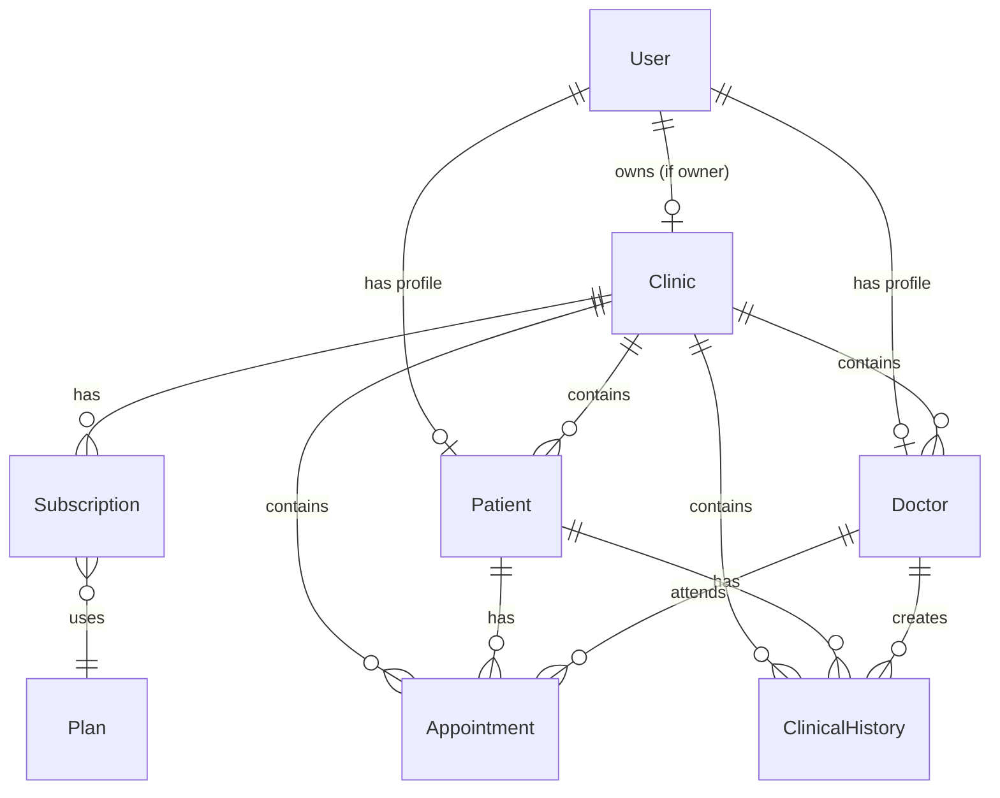

# Modelos de Datos

## Diagrama de Relaciones



## Schemas

### User

Usuario del sistema (cualquier rol).

```typescript
{
  _id: ObjectId,
  email: string,              // unique, required
  password: string,           // hashed with bcrypt
  firstName: string,          // required
  lastName: string,           // required
  phone?: string,
  role: enum [
    'platform_admin',
    'clinic_owner',
    'clinic_doctor',
    'clinic_staff',
    'patient'
  ],
  clinicId?: ObjectId,        // ref: Clinic
  doctorProfileId?: ObjectId, // ref: Doctor
  patientProfileId?: ObjectId,// ref: Patient
  isActive: boolean,          // default: true
  isEmailVerified: boolean,   // default: false
  lastLoginAt?: Date,
  passwordResetToken?: string,
  passwordResetExpires?: Date,
  isDeleted: boolean,         // default: false
  createdAt: Date,
  updatedAt: Date
}
```

### Clinic

Consultorio médico (tenant).

```typescript
{
  _id: ObjectId,
  name: string,               // required
  slug: string,               // unique, URL-friendly
  ownerId: ObjectId,          // ref: User
  address?: {
    street?: string,
    city?: string,
    state?: string,
    country?: string,
    postalCode?: string,
    coordinates?: {
      lat: number,
      lng: number
    }
  },
  phone?: string,
  email?: string,
  logo?: string,              // URL
  specialties: string[],
  schedule?: {
    monday?: { open: string, close: string },
    tuesday?: { open: string, close: string },
    // ... etc
  },
  settings?: Record<string, any>,
  isActive: boolean,          // default: true
  isDeleted: boolean,         // default: false
  createdAt: Date,
  updatedAt: Date
}
```

### Plan

Planes de suscripción disponibles.

```typescript
{
  _id: ObjectId,
  name: enum ['basic', 'professional', 'clinic'],
  displayName: string,
  priceMonthly: number,       // en centavos
  priceSemiannual: number,
  priceAnnual: number,
  maxDoctors: number,
  maxPatients: number,        // -1 = ilimitado
  features: string[],
  isActive: boolean,          // default: true
  createdAt: Date,
  updatedAt: Date
}
```

### Subscription

Suscripción de una clínica.

```typescript
{
  _id: ObjectId,
  clinicId: ObjectId,         // ref: Clinic, unique
  plan: enum ['basic', 'professional', 'clinic'],
  billingCycle: enum ['monthly', 'semiannual', 'annual'],
  status: enum [
    'trial',
    'active',
    'past_due',
    'cancelled',
    'expired'
  ],
  currentPeriodStart: Date,
  currentPeriodEnd: Date,
  trialEndsAt?: Date,
  cancelledAt?: Date,
  cancellationReason?: string,
  paymentMethod?: {
    type?: string,
    last4?: string,
    brand?: string,
    expiryMonth?: number,
    expiryYear?: number
  },
  stripeCustomerId?: string,
  stripeSubscriptionId?: string,
  paymentHistory?: [{
    date: Date,
    amount: number,
    status: string,
    invoiceId?: string
  }],
  createdAt: Date,
  updatedAt: Date
}
```

### Patient

Paciente de una clínica.

```typescript
{
  _id: ObjectId,
  clinicId: ObjectId,         // ref: Clinic, required
  userId?: ObjectId,          // ref: User (si tiene cuenta)
  firstName: string,          // required
  lastName?: string,
  birthDate?: Date,
  gender?: enum ['male', 'female', 'other'],
  documentType?: string,      // DNI, Passport, etc.
  documentNumber?: string,
  email?: string,
  phone?: string,
  address?: {
    street?: string,
    city?: string,
    state?: string,
    country?: string,
    postalCode?: string
  },
  occupation?: string,
  emergencyContactName?: string,
  emergencyContactPhone?: string,
  emergencyContactRelation?: string,
  allergies: string[],
  chronicConditions: string[],
  bloodType?: string,
  notes?: string,
  customFields?: Record<string, any>,
  isDeleted: boolean,         // default: false
  createdAt: Date,
  updatedAt: Date
}
```

**Indexes:**
- `{ clinicId: 1 }`
- `{ clinicId: 1, email: 1 }`
- `{ clinicId: 1, documentNumber: 1 }`
- `{ clinicId: 1, lastName: 1, firstName: 1 }`

### Doctor

Médico de una clínica.

```typescript
{
  _id: ObjectId,
  clinicId: ObjectId,         // ref: Clinic, required
  userId: ObjectId,           // ref: User, required, unique
  firstName: string,          // required
  lastName: string,           // required
  specialty: string,          // required
  subspecialties: string[],
  licenseNumber?: string,
  phone?: string,
  email?: string,
  bio?: string,
  education: [{
    institution: string,
    degree: string,
    year?: number,
    country?: string
  }],
  profileImage?: string,
  isPublicProfile: boolean,   // default: false
  averageRating: number,      // 0-5, default: 0
  totalReviews: number,       // default: 0
  isDeleted: boolean,         // default: false
  createdAt: Date,
  updatedAt: Date
}
```

**Indexes:**
- `{ clinicId: 1 }`
- `{ userId: 1 }` (unique)
- `{ clinicId: 1, specialty: 1 }`
- `{ isPublicProfile: 1, specialty: 1 }`

### Appointment

Cita médica.

```typescript
{
  _id: ObjectId,
  clinicId: ObjectId,         // ref: Clinic, required
  patientId: ObjectId,        // ref: Patient, required
  doctorId: ObjectId,         // ref: Doctor, required
  scheduledDate: Date,        // required
  startTime: string,          // "HH:MM", required
  endTime: string,            // "HH:MM", required
  status: enum [
    'scheduled',
    'confirmed',
    'in_progress',
    'completed',
    'cancelled',
    'no_show'
  ],
  reasonForVisit?: string,
  notes?: string,
  bookedBy: enum ['clinic', 'patient'],
  consultationId?: ObjectId,  // ref: Consultation
  cancelledAt?: Date,
  cancellationReason?: string,
  cancelledBy?: ObjectId,     // ref: User
  isDeleted: boolean,         // default: false
  createdAt: Date,
  updatedAt: Date
}
```

**Indexes:**
- `{ clinicId: 1, scheduledDate: 1 }`
- `{ clinicId: 1, doctorId: 1, scheduledDate: 1 }`
- `{ clinicId: 1, patientId: 1 }`
- `{ clinicId: 1, status: 1 }`

### ClinicalHistory

Historia clínica de un paciente.

```typescript
{
  _id: ObjectId,
  clinicId: ObjectId,         // ref: Clinic, required
  patientId: ObjectId,        // ref: Patient, required
  doctorId: ObjectId,         // ref: Doctor, required
  date: Date,
  notes: string,
  diagnosis?: string,
  treatment?: string,
  isDeleted: boolean,         // default: false
  createdAt: Date,
  updatedAt: Date
}
```

## Convenciones

1. **Soft Delete**: Todos los modelos usan `isDeleted: boolean` en lugar de eliminar documentos.

2. **Timestamps**: Todos los modelos incluyen `createdAt` y `updatedAt` automáticamente via `{ timestamps: true }`.

3. **Multi-tenancy**: Todos los modelos de negocio incluyen `clinicId` para aislamiento de datos.

4. **Referencias**: Usar `ObjectId` con `ref` para relaciones. Popular solo cuando sea necesario.

5. **Índices**: Siempre indexar `clinicId` y campos de búsqueda frecuente.
